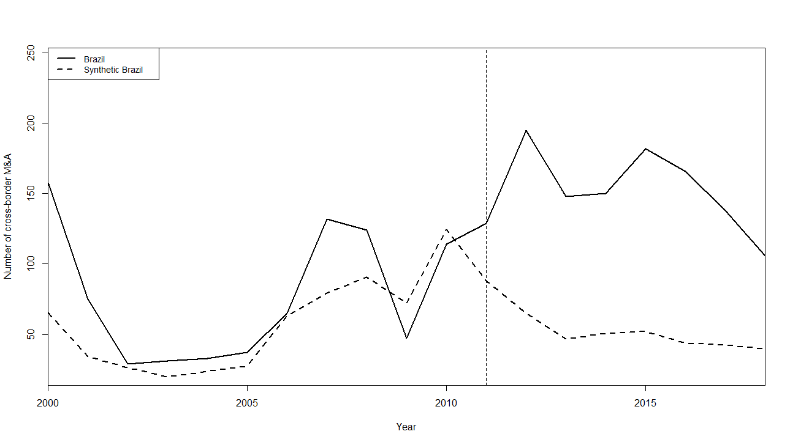
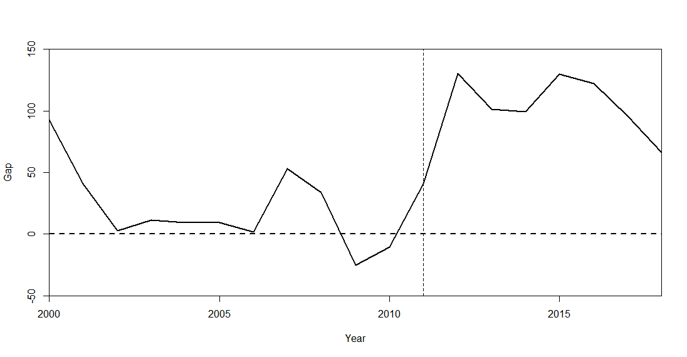
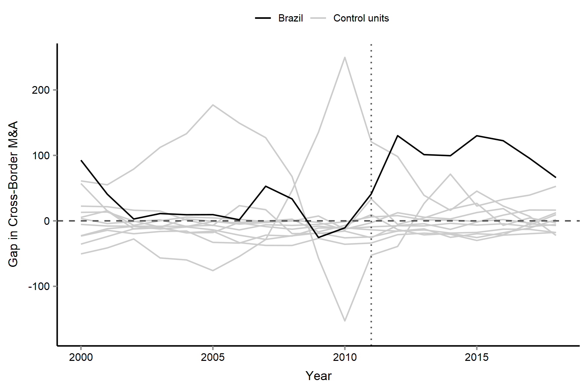
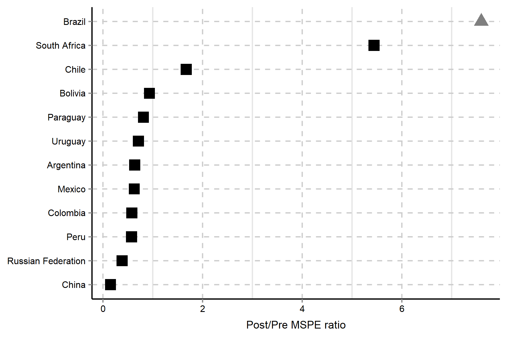

## 1. Introdução

-   **Objetivo**: Avaliar a mudança dos critérios de analises de atos de concentração (Lei 12.529/2011) nas fusões e aquisições internacionais no Brasil. Principalmente ex-post para ex-ante
-   **Hipótese**: Análise de atos de concentração ex-post criaria uma insegurança jurídica, principalmente para as empresas internacionais.
-   **Metodologia**: *Synthetic Control Method*
-   **Resultado**: De acordo com método utilizado, houve impacto estimado no número de fusões e aquisições em 742 operações realizadas.

## 2. Revisão da Literatura

-   Defesa da Concorrência e análise de atos de concentração

-   Método de controle Sintético

## 2.1 Defesa da Concorrência e análise de atos de concentração

-   Em menos de 20 anos o Brasil alterou o marco que regulava a defesa da concorrência: Lei nº 8.884/1994 e a Lei 12.529/2011

-   Lei nº 8.884/1994: alterações importantes

    -   Dentro do Contexto das Reformas regulatórias da década de noventa
    -   Transformou o Cade em Autarquia
    -   Controle *ex-post* de Atos de Concentração
    -   Atribuições compartilhadas com outros órgãos: SEAE e SDE
    -   Este tipo de análise geraria uma insegurança jurídica
    -   **Contraponto**: vantagens das análises *ex-post*

## 2.1 Defesa da Concorrência e análise de atos de concentração

-   Lei 12.529/11

    -   Intenção de cobrir lacunas e inserir inovações na legislação antitruste
    -   Centralização de algumas atribuições ao Cade: "SuperCade"
    -   Inovações processuais
    -   Instituiu a análise prévia de atos de Concentração
    -   Diversas outras eficiências

## 2.2 Método de Controle Sintético

-   Synthetic Control Method (SCM)
-   Abadie e Gardeazabal (2003) e Abadie *et al.* (2010)
-   Estimar os efeitos causais de intervenções
-   **Uma combinação de unidades não afetadas geralmente fornece comparação mais apropriada**
-   Unidades Agregadas
-   Uma unidade de Tratamento
-   Análise comparativa: Políticas Públicas, Economia, REL, CP e Saúde


## 2.2 SCM - Apresentação do Modelo

-   Amostra

    -   $(J+1)$ unidades
    -   $(j=1)$ a unidade de tratamento

-   Unidade Temporal

    -   $t=1,…T$
    -   $T_0$ é o último período pré-intervenção
    -   $(1<T_{0~}<T)$

## 2.2 Apresentação do Modelo

-   Variáveis

    -   $\mathbf{Y}$ é a variável de interesse - F&A internacionais
    -   $\mathbf{Y_{1t}^{I}}$ a unidade $j = 1$ no tempo $t$ que sofreu a intervenção
    -   $\mathbf{Y_{1t}^{N}}$ a unidade de tratamento caso não sofresse a intervenção
    -   $\mathbf{Y_{jt}^{N}}$ as unidades que não sofreram a intervenção

    ```{=tex}
    \begin{alertblock}{Contrafactual Teórico}
      O efeito do efeito da intervenção no período t é dado por: 
    $$\tau_{1t}=Y_{1t}^{I}- Y_{1t}^{N}$$
    \end{alertblock}
    ```

-   Obviamente $Y_{1t}^{N}$ é uma abstração teórica e é justamente o que o modelo deseja estimar

## 2.2 Apresentação do modelo - Estimação dos Parâmetro

```{=html}
<style>
body {
text-align: justify}
</style>
```
O método controle sintético forma uma unidade sintética através de uma combinação convexa de todo as unidades de comparação definida pelo vetor $W=~ \left( w_{2}, \ldots , w_{j+1} \right) ^{'}$, sendo $0 \leq w_{j} \leq 1$. Portanto:

```{=tex}
\begin{alertblock}{Estimação Unidade Sintética}
    
$$\mathbf{\hat{Y}_{1t}^{N}}=  \sum _{j=2}^{J+1}w_{j}Y_{jt}^{N},$$
\end{alertblock}
```
Com isso, também encontramos $\hat{ \tau}_{1t}$

### Estimação do Parâmetro

$$\hat{ \tau}_{1t}=~ Y_{1t}^{I}- \hat{Y}_{1t}^{N}$$

## 2.2 Apresentação do Modelo

<p style="text-align: justify;">

Assim, Seja $X_{1}$ um vetor de dimensão $\left( k \times 1 \right)$ contanto as características pré-tratamento da unidade de interesse e $X_{0}~$ como uma uma matriz $k~\mathrm{ \times J}$ contendo os valores da mesmas caracaterísticas dentre aos candidatos à unidade sintéticas (donor pool). Assim Abadie e Gardeazabal (2003), Abadie \textit{et al}. (2010) e Abadie (2019) definiram $W^{\ast} \textbf{ }$como o valor de $W$ \textbf{ }que minimiza a expressão:

</p>

```{=tex}
\begin{alertblock}{Encontrando $W^{\ast}$}
$$\min_w \quad\Vert X_{1}-X_{0}W \Vert V= \sqrt[]{ \left( X_{1}-X_{0}W \right) ^{'}V \left( X_{1}-X_{0}W \right)}$$
\end{alertblock}
```
### Encontrando o peso de cada variável $V^{*}$

$V_{k\mathrm{ \times }k}$ matriz simétrica semidefinida que tem função de atribuir os pesos em cada variável. $$\mathbf{V^{*}} = \Vert Y_{1}^{P}-Y_{0}^{P}\mathbf{W^{*}}(V) \Vert$$

## 3. Metodologia


1.  Uma vez definido a variável de interesse e a unidade de tratamento:

    -   Delimitação do *donor pool* e das variáveis
    -   Base de dados
    -   Apresentação dos Resultados e testes.

## 3.2 Base de dados - *escopo temporal*

-   Delimitação do Tempo

    -   Dados de 2000 a 2018

-   Data da Intervenção

    -   A Lei 12.529/2011 
    -   O ano 2011 escolhido como intervenção (teste 2012)

## 3.2 Base de dados - *Donor pool*

-   *Donor pool*: países dos BRICS, México e os países da América do Sul

    -   **Exceção**: Venezuela e Índia
    -   *Venezuela*: confiabilidade dos dados
    -   *Índia*: regulamentação similar em 2011

## 3.2 Base de dados - *Variáveis*

1.  **World Delevopment Indicator (WDI)**

    -   *GDP per capita (constant 2010 US\$)*
    -   *GDP growth (annual %)*
    -   *Foreign direct investment, net inflows (% of GDP)*
    -   *Final consumption expenditure (annual % growth)*

2.  **Heritage Foundation**

-   *Index of Economic Freedom*

## Peso de cada País na Unidade Sintética

```{=tex}
\begin{table}
\caption{Peso W na Unidade Sintétitica} 
\begin{tabular}{l | c |}
Country & W.weigth \\
\hline \hline
Argentina & 0.35 \\ 
Mexico & 0.28 \\
Russian Federation & 0.25 \\
Chile & 0.11 \\
Uruguay & 0.00 \\
South Africa & 0.00 \\
China & 0.00 \\
Colombia & 0.00 \\
Peru & 0.00 \\
Bolivia & 0.00 \\
Paraguay & 0.00 \\
\end{tabular}
\end{table}
```
## Peso das Variáveis

```{=tex}
\begin{table}[!htbp] \centering 
  \caption{Peso V na Unidade Sintétitica} 
  \label{} 
\begin{tabular}{@{\extracolsep{5pt}} cc} 
\\[-1.8ex]\hline 
\hline \\[-1.8ex] 
 & v.weights \\ 
\hline \\[-1.8ex] 
GDP\ per\  capita \ & $0.468$ \\ 
GDP\ growth\ annual\ (percent) & $0.062$ \\ 
FDI \ inflows\ percent\ of\ GDP & $0.388$ \\ 
Consumption\ expenditure\ growth  & $0.028$ \\ 
Index\ of\ Economic\ Freedom \  & $0.054$ \\ 
\hline \\[-1.8ex] 
\end{tabular} 
\end{table}
```
## Comparação ajustamento pré intervenção

```{=tex}
\begin{table}[!htbp] \centering 
  \caption{Ajustamento Pré-intervenção} 
  \label{} 
\begin{tabular}{@{\extracolsep{1pt}} cccc} 
\\[-1.8ex]\hline 
\hline \\[-1.8ex] 
 & Treated & Synthetic & Sample Mean \\ 
\hline \\[-1.8ex] 
GDP\ per\  capita \ & $9.180$ & $9.114$ & $8.640$ \\ 
GDP\ growth\ annual \ & $3.769$ & $3.507$ & $4.330$ \\ 
FDI \ inflows\ percent\ of\ GDP & $2.933$ & $2.949$ & $3.241$ \\ 
Consumption\ expenditure\ growth  & $3.615$ & $4.022$ & $4.318$ \\ 
Index\ of \ Economic \ Freedom & $59.745$ & $60.071$ & $61.940$ \\ 
\hline \\[-1.8ex] 
\end{tabular} 
\end{table}
```
## Resultado



## GAP



## Teste de Placebo



## Cálculo MSPE ratio1

### Razão MSPE

$${RMSPE}_{j}=~ \frac{\frac{ \sum _{t=T_{o}+1}^{T} \left( ~Y_{j,t}-\hat{Y}_{j,t}^{N} \right) ^{2}}{ \left( T-T_{0} \right) }}{\frac{ \sum _{t=1}^{T_{0}} \left( ~Y_{j,t}-\hat{Y}_{j,t}^{N} \right) ^{2}}{T_{0}}}~$$ E para cada $j \in {1, \ldots , J+1}$ calcula-se: $$p= \frac{ \sum _{j=1}^{J+1} \left[ \mathrm{RMSPE}_{j} \geq  \mathrm{RMSPE}_{1} \right] }{J+1}$$

Onde $p$ é a probabilidade de se obter MSPE maior que a unidade de intervenção.

## Post/Pré MSPE ratio



## Regressão Diferenças em Diferenças

```{=tex}
\begin{table}[!htbp] \centering 
  \label{}
  \resizebox{\linewidth}{!}{
\begin{tabular}{@{\extracolsep{210pt}}lcc} 
\\[-1.8ex]\hline 
\hline \\[-1.8ex] 
 & \multicolumn{2}{c}{\textit{Dependent variable:}} \\ 
\cline{2-3} 
\\[-1.8ex] & \multicolumn{2}{c}{Fusões e Aquisições Internacionais} \\ 
\\[-1.8ex] & (1) & (2)\\ 
\hline \\[-1.8ex] 
 GDP\ per\ capita\ &  & 31.93$^{***}$ \\ 
  &  & (6.94) \\ 
  & & \\ 
Annual\ Growth\ GDP\ ($\%$) &  & 5.48$^{**}$ \\ 
  &  & (2.30) \\ 
  & & \\ 
FDI\ ($\%$\ of\ GDP) &  & 4.87$^{***}$ \\ 
  &  & (1.84) \\ 
  & & \\ 
 Consumption \ Expenditure\ Growth\ ($\%$)  &  & $-$2.21 \\ 
  &  & (2.27) \\ 
  & & \\ 
 Index\ of\ Economic\ Freedom &  & $-$3.64$^{***}$ \\ 
  &  & (0.51) \\ 
  & & \\ 
 Trat & 34.45$^{*}$ & 12.24 \\ 
  & (18.26) & (16.30) \\ 
  & & \\ 
 Time & $-$1.67 & $-$8.04 \\ 
  & (8.12) & (7.35) \\ 
  & & \\ 
 \textbf{DID} & \textbf{76.60}$^{***}$ & \textbf{71.25}$^{***}$ \\ 
  & (28.14) & (24.63) \\ 
  & & \\ 
 Constant & 42.36$^{***}$ & $-$37.93 \\ 
  & (5.27) & (58.74) \\ 
  & & \\ 
\hline \\[-1.8ex] 
Observations & 228 & 228 \\ 
R$^{2}$ & 0.12 & 0.36 \\ 
Adjusted R$^{2}$ & 0.11 & 0.34 \\ 
Residual Std. Error & 57.98 (df = 224) & 49.93 (df = 219) \\ 
F Statistic & 10.28$^{***}$ (df = 3; 224) & 15.58$^{***}$ (df = 8; 219) \\ 
\hline 
\hline \\[-1.8ex] 
\textit{Note:}  & \multicolumn{2}{r}{$^{*}$p$<$0.1; $^{**}$p$<$0.05; $^{***}$p$<$0.01} \\ 
\end{tabular}
}
\end{table}
```
## Testes Adicionais
O Apêndice A, foram realizado os mesmos procedimentos acima com as mesmas unidades de comparação, porém com as covariadas defasadas. Apêndice B apresenta uma variação temporal, com as data de intervenção datada para o ano de 2012, mantendo-se as unidades de comparações originais. Verifica-se, tanto no Apêndice A como no Apêndice B, que o efeito é similar ao que foi apresentado ao longo deste trabalho.

## Testes Adicionais

Em relação ao Apêndice C e D, modificou-se o “donor pool”. No Apêndice C, foi inserido o rol de países emergentes. Neste novo desenho, embora ainda se tenha um Gap após a intervenção, o RSMPE parece ser inconclusivo, na medida em que o Brasil apresenta um resultado menor que outros dois países. No apêndice D, retirou-se do “donor pool” o país com um maior peso na unidade sintética (Argentina) e efetuou-se o mesmo exercício. Neste ultimo exercício, tanto o ajustamento quanto o resultado final não teve um resultado conclusivo

## Conclusão


<p style="text-align: justify;">

Os resultados indicam que houve um aumento entre o número de fusões e aquisições após o novo regramento. O resultado foi reforçado pelo teste de permutação e pela razão MSPE. Além disso, como uma checagem adicional, foi realizada uma regressão de diferenças em diferenças corroborou os resultados obtidos via controle sintético.

</p>

### Estimativa

Assim, diante do modelo apresentado, estimou-se que a nova regulação resultou em 742 novas aquisições em sete anos.
